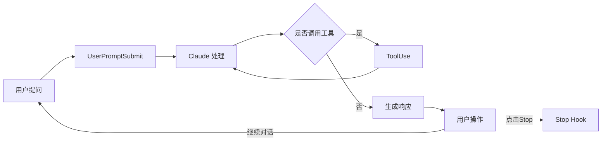

* Kramdown table of contents
{:toc .toc}

# Claude Code Hooks 完全指南：打造自动化工作流与飞书通知集成

> 🚀 本文将带你深入了解 Claude Code 的 Hook 机制，通过一个完整的飞书通知集成案例，教你如何打造属于自己的自动化工作流。

## 📖 目录

- [什么是 Claude Code Hooks](#什么是-claude-code-hooks)
- [Hook 类型详解](#hook-类型详解)
- [快速开始：配置你的第一个 Hook](#快速开始配置你的第一个-hook)
- [实战案例：飞书通知集成](#实战案例飞书通知集成)
- [调试与故障排查](#调试与故障排查)
- [最佳实践](#最佳实践)
- [进阶技巧](#进阶技巧)

---

## 什么是 Claude Code Hooks

Claude Code Hooks 是一种**事件驱动的自动化机制**，它允许你在特定事件发生时自动执行自定义脚本或命令。这个机制类似于 Git Hooks，但专门为 AI 编程助手场景设计。

### 🎯 核心价值

- **📝 自动化记录**：自动保存每次提问和回答，构建个人知识库
- **📢 实时通知**：任务完成后自动推送通知到 Slack、飞书、钉钉等平台
- **🔄 流程自动化**：触发测试、部署、备份等后续操作
- **📊 数据分析**：统计使用频率、问题类型、响应时间等指标
- **🔗 工具集成**：与现有工作流无缝对接

### 💡 应用场景

1. **团队协作**：任务完成后自动通知团队成员
2. **项目管理**：自动更新任务状态、记录工时
3. **知识管理**：构建问答历史库，便于回顾和分享
4. **质量保证**：代码生成后自动运行测试
5. **合规审计**：记录所有 AI 交互历史

---

## Hook 类型详解

Claude Code 提供了丰富的 Hook 事件，覆盖整个交互生命周期：

| Hook 名称 | 触发时机 | 典型用途 | 可用数据 |
|-----------|---------|---------|---------|
| `UserPromptSubmit` | 用户提交问题时 | 保存提问、发送开始通知、初始化环境 | 用户输入文本、项目信息 |
| `Stop` | 用户点击 Stop 或任务完成 | 发送完成通知、清理资源、生成报告 | 执行状态、耗时 |
| `ToolUse` | AI 调用工具时 | 记录工具使用、权限控制 | 工具名称、参数 |
| `ApiRequestStart` | API 请求开始时 | 计费预警、流量控制 | 请求内容、Token 数 |
| `ApiRequestFinish` | API 请求结束时 | 性能分析、错误追踪、成本统计 | 响应内容、耗时、费用 |

### 🔍 Hook 执行流程



---

## 快速开始：配置你的第一个 Hook

### Step 1: 找到配置文件

```bash
# macOS/Linux
~/.claude/settings.json

# Windows
%USERPROFILE%\.claude\settings.json
```

### Step 2: 编写简单的 Hook

创建一个最简单的通知 Hook：

```json
{
  "hooks": {
    "Stop": [
      {
        "matcher": "",
        "hooks": [
          {
            "type": "command",
            "command": "echo 'Task completed!' | tee -a ~/.claude/tasks.log"
          }
        ]
      }
    ]
  }
}
```

### Step 3: 测试验证

1. 重启 Claude Code（确保配置生效）
2. 执行任意任务
3. 点击 Stop 按钮
4. 检查日志文件：`cat ~/.claude/tasks.log`

恭喜！你已经成功配置了第一个 Hook 🎉

---

## 实战案例：飞书通知集成

让我们通过一个完整的案例，实现从用户提问到飞书通知的全流程自动化。

### 📐 系统架构

```
┌─────────────────────┐
│  用户提交问题        │
└──────────┬──────────┘
           │
           ▼
┌──────────────────────────────────┐
│  UserPromptSubmit Hook           │
│  • 保存问题内容                   │
│  • 记录时间戳                     │
│  • 获取项目信息                   │
└──────────┬───────────────────────┘
           │
           ▼
┌─────────────────────┐
│  Claude 处理问题     │
│  • 理解需求          │
│  • 生成代码          │
│  • 执行操作          │
└──────────┬──────────┘
           │
           ▼
┌─────────────────────┐
│  用户点击 Stop       │
└──────────┬──────────┘
           │
           ▼
┌──────────────────────────────────┐
│  Stop Hook                        │
│  • 读取保存的问题                  │
│  • 构造通知内容                    │
│  • 发送到飞书                     │
│  • 记录发送日志                   │
└──────────────────────────────────┘
           │
           ▼
┌─────────────────────┐
│  飞书收到通知        │
│  • 项目名称          │
│  • 问题内容          │
│  • 完成时间          │
└─────────────────────┘
```

### Step 1: 配置 Hook 系统

编辑 `~/.claude/settings.json`：

```json
{
  "hooks": {
    "UserPromptSubmit": [
      {
        "matcher": "",
        "hooks": [
          {
            "type": "command",
            "command": "bash -c 'cd /your/project/path && if [ -f .claude/scripts/save-prompt.sh ]; then bash .claude/scripts/save-prompt.sh; fi'"
          }
        ]
      }
    ],
    "Stop": [
      {
        "matcher": "",
        "hooks": [
          {
            "type": "command",
            "command": "bash -c 'cd /your/project/path && if [ -f .claude/scripts/feishu-notify.sh ]; then bash .claude/scripts/feishu-notify.sh; fi'"
          }
        ]
      }
    ]
  }
}
```

> ⚠️ **重要提示**：请将 `/your/project/path` 替换为你的实际项目路径

### Step 2: 创建问题保存脚本

创建 `.claude/scripts/save-prompt.sh`：

```bash
#!/bin/bash

# ===========================================
# Claude Code UserPromptSubmit Hook
# 功能：保存用户提问，为后续通知提供数据
# ===========================================

set -e

# 配置
LOG_DIR="${HOME}/.claude/prompts"
TIMESTAMP=$(date '+%Y%m%d_%H%M%S')
PROJECT_DIR="${CLAUDE_PROJECT_DIR:-$(pwd)}"
PROJECT_NAME=$(basename "$PROJECT_DIR")

# 确保日志目录存在
mkdir -p "$LOG_DIR"

# 构造保存文件路径
PROMPT_FILE="${LOG_DIR}/${PROJECT_NAME}_${TIMESTAMP}.txt"

# 保存问题详情
{
    echo "==================================="
    echo "Time: $(date '+%Y-%m-%d %H:%M:%S')"
    echo "Project: $PROJECT_NAME"
    echo "Path: $PROJECT_DIR"
    echo "Session: ${CLAUDE_SESSION_ID:-unknown}"
    echo "==================================="
    echo ""
    cat  # 从 stdin 读取用户输入
} > "$PROMPT_FILE"

# 记录操作日志
echo "[$(date '+%Y-%m-%d %H:%M:%S')] Prompt saved: $PROMPT_FILE" >> "${HOME}/.claude/hook.log"

exit 0
```

### Step 3: 创建飞书通知脚本

创建 `.claude/scripts/feishu-notify.sh`：

```bash
#!/bin/bash

# ===========================================
# Claude Code Stop Hook - 飞书通知
# 功能：任务完成后发送飞书通知
# ===========================================

set -e

# 配置
LOG_FILE="${HOME}/.claude/feishu-notify.log"
TIMESTAMP=$(date '+%Y-%m-%d %H:%M:%S')
PROJECT_DIR="${CLAUDE_PROJECT_DIR:-$(pwd)}"
PROJECT_NAME=$(basename "$PROJECT_DIR")

# 飞书 Webhook URL（需要替换为你的实际 webhook）
FEISHU_WEBHOOK="${FEISHU_WEBHOOK_URL:-https://www.feishu.cn/flow/api/trigger-webhook/YOUR_TOKEN}"

# 日志记录函数
log() {
    echo "[$TIMESTAMP] $1" >> "$LOG_FILE"
}

log "Stop hook triggered for project: $PROJECT_NAME"

# 获取最新的用户问题
PROMPT_DIR="${HOME}/.claude/prompts"
LATEST_PROMPT_FILE=$(ls -t "${PROMPT_DIR}/${PROJECT_NAME}"_*.txt 2>/dev/null | head -1)

if [ -f "$LATEST_PROMPT_FILE" ]; then
    log "Found prompt file: $LATEST_PROMPT_FILE"
    
    # 提取 JSON 数据
    JSON_LINE=$(grep -E '^\{.*\}$' "$LATEST_PROMPT_FILE" 2>/dev/null || echo "{}")
    
    # 使用合适的工具解析 JSON
    if command -v jq &> /dev/null; then
        # 优先使用 jq（最可靠）
        USER_QUESTION=$(echo "$JSON_LINE" | jq -r '.prompt // "Claude Code 任务完成"' | \
                       sed 's/<[^>]*>//g' | head -c 200)
    elif command -v python3 &> /dev/null; then
        # 降级到 Python
        USER_QUESTION=$(echo "$JSON_LINE" | python3 -c "
import sys, json
try:
    data = json.load(sys.stdin)
    print(data.get('prompt', 'Claude Code 任务完成')[:200])
except:
    print('Claude Code 任务完成')
" | sed 's/<[^>]*>//g')
    else
        # 最后使用 sed（可能不够可靠）
        USER_QUESTION="Claude Code 任务完成"
    fi
else
    log "No prompt file found, using default message"
    USER_QUESTION="Claude Code 任务完成"
fi

# 构造飞书消息
if command -v jq &> /dev/null; then
    # 使用 jq 构造 JSON（自动处理转义）
    JSON_DATA=$(jq -n \
        --arg project "$PROJECT_NAME" \
        --arg time "$TIMESTAMP" \
        --arg question "$USER_QUESTION" \
        '{
            msg_type: "text",
            content: {
                project_name: $project,
                finish_time: $time,
                question: $question
            }
        }')
else
    # 手动构造 JSON（注意转义）
    USER_QUESTION_ESCAPED=$(echo "$USER_QUESTION" | \
                           sed 's/\\/\\\\/g' | \
                           sed 's/"/\\"/g' | \
                           sed 's/\t/ /g' | \
                           tr -d '\n\r')
    
    JSON_DATA=$(cat <<EOF
{
    "msg_type": "text",
    "content": {
        "project_name": "${PROJECT_NAME}",
        "finish_time": "${TIMESTAMP}",
        "question": "${USER_QUESTION_ESCAPED}"
    }
}
EOF
)
fi

log "Sending notification with data: $JSON_DATA"

# 发送飞书通知
if [ -n "$FEISHU_WEBHOOK" ] && [ "$FEISHU_WEBHOOK" != *"YOUR_TOKEN"* ]; then
    RESPONSE=$(curl -s -X POST "$FEISHU_WEBHOOK" \
        -H 'Content-Type: application/json' \
        -d "$JSON_DATA" 2>&1)
    
    log "API Response: $RESPONSE"
    
    # 检查响应
    if echo "$RESPONSE" | grep -q "success\|ok\|200"; then
        log "✅ Notification sent successfully"
        echo "✅ 飞书通知已发送：$PROJECT_NAME - $USER_QUESTION"
    else
        log "⚠️ Notification may have failed: $RESPONSE"
        echo "⚠️ 飞书通知可能失败，请检查日志：$LOG_FILE"
    fi
else
    log "❌ FEISHU_WEBHOOK not configured properly"
    echo "❌ 请配置飞书 Webhook URL"
fi

exit 0
```

### Step 4: 配置飞书工作流

1. **创建工作流**
   - 登录飞书，进入「工作台」→「工作流」
   - 点击「创建工作流」
   - 选择「自定义触发器」

2. **配置 Webhook 触发器**
   - 添加「Webhook」触发器
   - 配置输入参数：
     ```
     project_name (文本) - 项目名称
     finish_time (文本) - 完成时间
     question (文本) - 问题内容
     ```

3. **设计通知流程**
   - 添加「发送消息」节点
   - 配置消息模板：
     ```
     🤖 Claude Code 任务完成通知
     
     📁 项目：{{project_name}}
     ❓ 问题：{{question}}
     ⏰ 时间：{{finish_time}}
     ```

4. **获取 Webhook URL**
   - 保存工作流
   - 复制 Webhook URL
   - 替换脚本中的 `YOUR_TOKEN`

### Step 5: 设置权限和测试

```bash
# 设置执行权限
chmod +x .claude/scripts/save-prompt.sh
chmod +x .claude/scripts/feishu-notify.sh

# 测试保存功能
echo '{"prompt": "测试问题"}' | bash .claude/scripts/save-prompt.sh

# 测试通知功能
bash .claude/scripts/feishu-notify.sh

# 查看日志
tail -f ~/.claude/feishu-notify.log
```

### 🎯 效果展示

当你在 Claude Code 中完成任务后，飞书会收到这样的通知：

```
🤖 Claude Code 任务完成通知

📁 项目：my-awesome-project
❓ 问题：帮我实现一个 Redis 缓存管理器
⏰ 时间：2025-10-21 15:30:45

点击查看详情 →
```

---

## 调试与故障排查

### 🔍 常见问题与解决方案

#### 问题 1：Hook 没有被触发

**症状**：配置了 Hook 但没有任何反应

**排查步骤**：

1. **验证配置文件语法**
   ```bash
   # 使用 jq 验证 JSON 格式
   cat ~/.claude/settings.json | jq .
   ```

2. **检查脚本路径和权限**
   ```bash
   # 确认脚本存在
   ls -la .claude/scripts/
   
   # 确认有执行权限
   chmod +x .claude/scripts/*.sh
   ```

3. **启用调试日志**
   ```bash
   # 在脚本开头添加
   set -x  # 打印每条命令
   exec 2>> ~/.claude/debug.log  # 重定向错误输出
   ```

4. **手动测试脚本**
   ```bash
   # 直接运行脚本测试
   bash -x .claude/scripts/feishu-notify.sh
   ```

#### 问题 2：环境变量为空

**症状**：`CLAUDE_PROJECT_DIR` 等环境变量获取不到值

**解决方案**：

```bash
# 使用绝对路径（推荐）
"command": "bash -c 'cd /absolute/path/to/project && bash .claude/scripts/hook.sh'"

# 或使用默认值
PROJECT_DIR="${CLAUDE_PROJECT_DIR:-$(pwd)}"
```

#### 问题 3：JSON 格式错误

**症状**：飞书返回格式错误或无响应

**解决方案**：

1. **验证 JSON 格式**
   ```bash
   echo "$JSON_DATA" | jq .
   ```

2. **正确转义特殊字符**
   ```bash
   # 转义顺序很重要
   TEXT=$(echo "$TEXT" | sed 's/\\/\\\\/g' | sed 's/"/\\"/g')
   ```

3. **使用工具构造 JSON**
   ```bash
   # 推荐：使用 jq
   JSON=$(jq -n --arg key "$value" '{key: $key}')
   ```

#### 问题 4：通知发送失败

**症状**：脚本执行但飞书没收到通知

**调试技巧**：

```bash
# 1. 打印完整的 curl 命令
echo "curl -X POST '$WEBHOOK' -H 'Content-Type: application/json' -d '$JSON_DATA'" >> debug.log

# 2. 保存响应详情
RESPONSE=$(curl -v -X POST "$WEBHOOK" -d "$JSON_DATA" 2>&1)
echo "Full response: $RESPONSE" >> debug.log

# 3. 测试 Webhook 连通性
curl -X POST "$WEBHOOK" -d '{"msg_type":"text","content":{"text":"test"}}'
```

### 📊 调试检查清单

- [ ] 配置文件格式正确（JSON 语法）
- [ ] 脚本文件存在且有执行权限
- [ ] 路径使用绝对路径或正确的相对路径
- [ ] 环境变量正确获取或有默认值
- [ ] JSON 数据格式符合 API 要求
- [ ] Webhook URL 正确且未过期
- [ ] 网络连接正常（可以访问外部 API）
- [ ] 日志文件有写入权限

---

## 最佳实践

### 1. 📁 项目结构规范

```
your-project/
├── .claude/
│   ├── hooks.json          # 项目级 Hook 配置
│   ├── scripts/            # Hook 脚本目录
│   │   ├── save-prompt.sh
│   │   ├── notify.sh
│   │   └── test.sh
│   └── logs/               # 日志目录
│       ├── prompts/
│       └── notifications/
```

### 2. 🔒 安全性建议

**敏感信息管理**：

```bash
# ❌ 不要硬编码
WEBHOOK="https://example.com/webhook/secret_token_123"

# ✅ 使用环境变量
WEBHOOK="${FEISHU_WEBHOOK_URL}"

# ✅ 或使用配置文件（添加到 .gitignore）
source ~/.claude/secrets.env
```

**权限控制**：

```bash
# 限制脚本权限
chmod 700 .claude/scripts/*.sh  # 仅所有者可执行

# 限制日志权限
chmod 600 ~/.claude/logs/*      # 仅所有者可读写
```

### 3. 🚀 性能优化

**异步执行**：

```bash
# 避免阻塞主流程
{
    # 耗时操作
    sleep 2
    curl -X POST "$WEBHOOK" -d "$DATA"
} &  # 后台执行
```

**缓存机制**：

```bash
# 缓存常用数据
CACHE_FILE="$HOME/.claude/cache/project_info.json"

if [ -f "$CACHE_FILE" ] && [ $(($(date +%s) - $(stat -f %m "$CACHE_FILE"))) -lt 3600 ]; then
    # 使用缓存（1小时内）
    PROJECT_INFO=$(cat "$CACHE_FILE")
else
    # 重新获取并缓存
    PROJECT_INFO=$(get_project_info)
    echo "$PROJECT_INFO" > "$CACHE_FILE"
fi
```

### 4. 📝 日志管理

**结构化日志**：

```bash
# 统一日志格式
log() {
    local level=$1
    shift
    echo "[$(date '+%Y-%m-%d %H:%M:%S')] [$level] $*" >> "$LOG_FILE"
}

log INFO "Starting hook execution"
log ERROR "Failed to send notification: $error"
log DEBUG "JSON data: $JSON_DATA"
```

**日志轮转**：

```bash
# 自动清理旧日志
MAX_LOG_SIZE=10485760  # 10MB

if [ -f "$LOG_FILE" ] && [ $(stat -f %z "$LOG_FILE") -gt $MAX_LOG_SIZE ]; then
    mv "$LOG_FILE" "${LOG_FILE}.$(date +%Y%m%d)"
    gzip "${LOG_FILE}.$(date +%Y%m%d)"
fi
```

### 5. 🔄 错误恢复

**重试机制**：

```bash
# 自动重试
MAX_RETRIES=3
RETRY_DELAY=5

for i in $(seq 1 $MAX_RETRIES); do
    if curl -X POST "$WEBHOOK" -d "$DATA"; then
        log INFO "Notification sent successfully"
        break
    else
        log WARN "Attempt $i failed, retrying in ${RETRY_DELAY}s..."
        sleep $RETRY_DELAY
    fi
done
```

**降级处理**：

```bash
# 主通道失败时使用备用通道
if ! send_to_feishu; then
    log WARN "Feishu failed, trying email..."
    send_email_notification
fi
```

---

## 进阶技巧

### 1. 🎯 智能路由

根据不同条件路由到不同处理器：

```bash
#!/bin/bash

# 根据项目类型选择通知渠道
case "$PROJECT_NAME" in
    *-frontend)
        notify_frontend_team
        ;;
    *-backend)
        notify_backend_team
        ;;
    *-urgent)
        notify_all_channels
        ;;
    *)
        notify_default_channel
        ;;
esac

# 根据时间选择通知级别
HOUR=$(date +%H)
if [ $HOUR -ge 22 ] || [ $HOUR -le 6 ]; then
    # 夜间静默模式
    log INFO "Night mode: notification saved for tomorrow"
    queue_for_tomorrow
else
    send_immediate_notification
fi
```

### 2. 📊 数据分析

收集和分析使用数据：

```bash
#!/bin/bash

# 记录使用统计
STATS_DB="$HOME/.claude/stats.db"

# 使用 SQLite 存储（如果可用）
if command -v sqlite3 &> /dev/null; then
    sqlite3 "$STATS_DB" <<EOF
    CREATE TABLE IF NOT EXISTS usage_stats (
        id INTEGER PRIMARY KEY AUTOINCREMENT,
        timestamp DATETIME DEFAULT CURRENT_TIMESTAMP,
        project TEXT,
        question TEXT,
        duration INTEGER,
        tokens_used INTEGER
    );
    
    INSERT INTO usage_stats (project, question, duration, tokens_used)
    VALUES ('$PROJECT_NAME', '$QUESTION', $DURATION, $TOKENS);
EOF
    
    # 生成周报
    if [ "$(date +%u)" -eq 1 ]; then  # 周一
        WEEKLY_STATS=$(sqlite3 "$STATS_DB" <<EOF
        SELECT 
            COUNT(*) as total_queries,
            AVG(duration) as avg_duration,
            SUM(tokens_used) as total_tokens,
            GROUP_CONCAT(DISTINCT project) as projects
        FROM usage_stats
        WHERE timestamp >= datetime('now', '-7 days');
EOF
        )
        send_weekly_report "$WEEKLY_STATS"
    fi
fi
```

### 3. 🔗 工具链集成

与其他开发工具集成：

```bash
#!/bin/bash

# Git 集成
if [ -d .git ]; then
    CURRENT_BRANCH=$(git branch --show-current)
    LAST_COMMIT=$(git log -1 --pretty=format:"%h - %s")
    
    # 自动提交 AI 生成的代码
    if [ "$AUTO_COMMIT" = "true" ]; then
        git add -A
        git commit -m "AI: $USER_QUESTION"
        log INFO "Auto-committed changes"
    fi
fi

# Docker 集成
if [ -f docker-compose.yml ]; then
    # 重新构建和部署
    docker-compose down
    docker-compose build
    docker-compose up -d
    log INFO "Docker services redeployed"
fi

# 测试集成
if [ -f package.json ]; then
    npm test && log INFO "Tests passed" || log ERROR "Tests failed"
fi
```

### 4. 🤖 AI 增强

利用 AI 能力增强 Hook：

```bash
#!/bin/bash

# 使用 AI 分析问题类型
analyze_question() {
    local question=$1
    
    # 调用本地 LLM 或 API
    local category=$(echo "$question" | \
        curl -s -X POST "http://localhost:11434/api/generate" \
        -d "{\"model\": \"llama2\", \"prompt\": \"Categorize: $question\"}" | \
        jq -r .response)
    
    echo "$category"
}

# 智能通知
CATEGORY=$(analyze_question "$USER_QUESTION")

case "$CATEGORY" in
    "bug-fix")
        notify_qa_team
        create_jira_ticket
        ;;
    "feature")
        notify_product_team
        update_roadmap
        ;;
    "optimization")
        run_benchmark
        notify_if_improved
        ;;
esac
```

### 5. 🌍 多环境支持

支持开发、测试、生产环境：

```bash
#!/bin/bash

# 检测环境
detect_environment() {
    if [ -f .env.production ]; then
        echo "production"
    elif [ -f .env.staging ]; then
        echo "staging"
    else
        echo "development"
    fi
}

ENV=$(detect_environment)

# 加载环境配置
source ".env.$ENV"

# 环境特定行为
case "$ENV" in
    production)
        WEBHOOK="$PROD_WEBHOOK"
        NOTIFY_LEVEL="error"
        AUTO_DEPLOY=false
        ;;
    staging)
        WEBHOOK="$STAGE_WEBHOOK"
        NOTIFY_LEVEL="warning"
        AUTO_DEPLOY=true
        ;;
    development)
        WEBHOOK="$DEV_WEBHOOK"
        NOTIFY_LEVEL="debug"
        AUTO_DEPLOY=false
        ;;
esac

log INFO "Running in $ENV environment"
```

---

## 总结

通过本文的学习，你已经掌握了 Claude Code Hooks 的核心概念和实战技巧：

### ✅ 你学到了什么

1. **基础知识**
   - Hook 的工作原理和事件类型
   - 配置文件的编写方法
   - 脚本的基本结构

2. **实战技能**
   - 完整的飞书通知集成方案
   - JSON 数据的处理和转义
   - 错误排查和调试方法

3. **高级技巧**
   - 安全性和性能优化
   - 多环境和多渠道支持
   - 与其他工具的集成

### 🎯 下一步行动

1. **立即尝试**：从最简单的日志记录 Hook 开始
2. **逐步完善**：根据实际需求添加更多功能
3. **分享经验**：将你的 Hook 配置分享给团队
4. **持续优化**：根据使用反馈不断改进

### 💡 核心要点回顾

- 🔧 使用绝对路径避免环境变量问题
- 🛡️ 保护敏感信息，使用环境变量
- 📝 记录详细日志，便于调试
- 🔄 实现错误重试和降级机制
- 🚀 异步执行避免阻塞主流程

---

## 参考资源

- [Claude Code 官方文档](https://docs.claude.com/claude-code)
- [飞书工作流 API 文档](https://open.feishu.cn/document/ukTMukTMukTM/uATM3YjLwEzN24CM3cjN)
- [jq 命令行 JSON 处理器](https://stedolan.github.io/jq/manual/)
- [Bash 脚本最佳实践](https://google.github.io/styleguide/shellguide.html)

---

*💬 有问题或建议？欢迎在评论区交流！如果这篇文章对你有帮助，请分享给更多人 🚀*